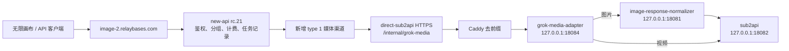

# Grok Imagine 媒体模型接入开发计划

> 状态：已完成并上线（2026-07-14，v0.4.14）。本文同时记录开发、测试、上线和回滚方案。

## 目标

接入以下三个模型：

- `grok-imagine-edit`
- `grok-imagine-image-quality`
- `grok-imagine-video-1.5`

同时完成：

- 图片模型按 `0.08 元/张`计费。
- 视频模型直接照抄当前 VEO 的基础单价，按 `0.16 元/秒`计费。
- 图片只开放同步图片接口，不伪造异步图片任务。
- `grok-imagine-video-1.5` 按官方能力只开放异步任务接口，因此不做 4 倍计费。
- 模型广场补齐价格、厂商、图标、能力、输入输出模态、端点和中英文说明。
- Cloudflare Worker 补齐模型白名单、端点限制、价格和元数据。
- 三个模型接入生图工作台、视频工作台和无限画布生成流程。
- 完成真实接口测试、回归测试、生产发布和版本发版。

## 不可越过的边界

- 不修改 `new-api` 源码、镜像或数据库结构。
- 不修改 `sub2api` 源码或镜像。
- 不改变现有 VEO、Nana Banana 等模型的价格、计费规则或功能。
- `new-api` 只允许做渠道、模型能力、价格和模型广场数据配置。
- 协议转换放在允许维护的自研服务中。
- 无限画布源码只在 `E:\RelayBases\relaybases-canvas` 修改。
- 官网和 Worker 源码只在 `E:\RelayBases\relaybases-site` 修改。
- 服务端自研适配器只在 s12 的 `/root/relaybases-selfhosted-scripts` 开发和版本化。
- 密钥不写入仓库、补丁、日志、文档或测试产物。

## 已核验现状

### new-api

生产环境当前为官方 `calciumion/new-api:v1.0.0-rc.21`。

- 当前 #106 是 Grok/type 48 渠道。
- type 48 没有视频 `TaskAdaptor`，视频请求会在 new-api 内部报 `invalid_api_platform: 48`，不会到达上游。
- type 48 图片适配也不能完整保留本次需要的尺寸、质量和参考图字段。
- type 1/OpenAI 渠道已经具备需要的图片转发和 Sora 风格视频任务能力，无需修改 new-api 源码。
- type 1 的渠道 Base URL 会直接拼接原始 `/v1/...` 路径，因此 Base URL 不能再带 `/v1`。

### 现有公开端点

RelayBases 媒体 Base URL 保持不变：

```text
https://image-2.relaybases.com
```

本次使用的公开端点为：

```text
POST /v1/images/generations
POST /v1/images/edits

POST /v1/videos
GET  /v1/videos/{task_id}
GET  /v1/videos/{task_id}/content
```

`grok-imagine-video-1.5` 不开放 `/v1/video/generations`。该模型官方接口是异步任务，不用现有的“同步视频入口”包装成伪同步，也不收异步 4 倍价格。

### 官方模型能力

| 模型 | 能力 | 调用方式 | 参考素材 | 主要参数 |
| --- | --- | --- | --- | --- |
| `grok-imagine-edit` | RelayBases/sub2 兼容编辑别名，实际上游映射到 `grok-imagine-image-quality` | 同步 `POST /v1/images/edits` | 1–3 张图片 | 1K/2K、官方图片比例 |
| `grok-imagine-image-quality` | 文生图和图片编辑 | 同步 `POST /v1/images/generations` 或 `/v1/images/edits` | 编辑时 1–3 张图片 | `n=1–10`、1K/2K、官方图片比例 |
| `grok-imagine-video-1.5` | 图生视频，不支持纯文生视频，也不支持多参考图视频 | 异步 `POST /v1/videos` | 恰好 1 张图片 | 1–15 秒、官方比例、480p/720p/1080p |

图片官方比例：

```text
auto, 1:1, 16:9, 9:16, 4:3, 3:4, 3:2, 2:3,
2:1, 1:2, 19.5:9, 9:19.5, 20:9, 9:20
```

视频官方比例：

```text
1:1, 16:9, 9:16, 4:3, 3:4, 3:2, 2:3
```

核验依据：

- [xAI：grok-imagine-video-1.5](https://docs.x.ai/developers/models/grok-imagine-video-1.5)
- [xAI：图片生成参数](https://docs.x.ai/developers/model-capabilities/images/generation)
- [xAI：多图编辑限制](https://docs.x.ai/developers/model-capabilities/images/multi-image-editing)
- [new-api rc.21：视频路由](https://github.com/QuantumNous/new-api/blob/bde9b2f44887d34ec54799ae191d50f97914359e/router/video-router.go#L19-L32)
- [new-api rc.21：Sora 任务适配器](https://github.com/QuantumNous/new-api/blob/bde9b2f44887d34ec54799ae191d50f97914359e/relay/channel/task/sora/adaptor.go#L132-L330)
- [RelayBases：现有图片与视频任务接口](https://site.relaybases.com/usage-doc.html#zh-async-media-api)

## 同步与异步结论

| 媒体 | 模式 | 本次是否开放 | 计费 |
| --- | --- | --- | --- |
| 图片生成 | 同步 | 是 | `0.08 × 实际返回张数` |
| 图片编辑 | 同步 | 是 | `0.08 × 实际返回张数` |
| 图片任务 | 异步 | 否 | 不适用 |
| Grok 视频任务 | 异步 | 是 | `0.16 × duration 秒数`，不做 4X |
| Grok 视频阻塞同步 | 同步 | 否 | 不适用 |

以后只有在上游和 RelayBases 都真正提供同一视频模型的同步、异步两套能力时，才按“同步基础价、异步 4X”处理。本次不预留隐藏开关，也不新增伪同步实现。

## 目标架构



这个结构保留现有用户 Key、`media` 分组、new-api 账单和公开 URL，只在 new-api 与 sub2api 之间增加一个不公开的协议适配器。

## new-api 配置方案

### 复用现有渠道

不新增渠道、不创建测试后缀模型，也不修改三个既有模型名。直接把现有 #106 `grok` 渠道从 type 48 调整为 type 1/OpenAI，并保留原有 `media` 分组、渠道 Key 和三个模型能力：

```text
type: OpenAI / 1
group: media
base_url: https://direct-sub2api.relaybases.com/internal/grok-media
models:
  - grok-imagine-edit
  - grok-imagine-image-quality
  - grok-imagine-video-1.5
```

要求：

- Base URL 末尾不带 `/v1`。
- 渠道 Key 使用现有 sub2 媒体渠道配置，不回显、不另存到适配器文件。
- `grok-imagine-edit` 不在 new-api 提前改名，由适配器在完成 edit-only 端点校验后再映射为 `grok-imagine-image-quality`，避免绕过仅编辑限制。
- 三个模型继续使用 #106 的既有能力记录，不新建同名或后缀能力。
- 不启用 body pass-through，避免模型映射和请求重建失效。

### 价格配置

在 new-api `ModelPrice` 中配置：

| 模型 | ModelPrice | new-api 计费因子 | 基础展示价 |
| --- | ---: | --- | --- |
| `grok-imagine-edit` | `0.08` | `n` | `0.08 元/张` |
| `grok-imagine-image-quality` | `0.08` | `n` | `0.08 元/张` |
| `grok-imagine-video-1.5` | `0.16` | `duration` | `0.16 元/秒` |

示例：

- 图片 `n=1` 扣 `0.08`，`n=3` 扣 `0.24`。
- 视频 8 秒扣 `1.28`，15 秒扣 `2.40`。
- 视频只有异步入口，不乘 4。
- 以上是 `media` 基础价；最终账单仍叠加用户实际分组倍率。

按已确认要求直接照抄 VEO 的 `0.16 元/秒`，不拆分分辨率价格，也不增加额外模型别名。

## grok-media-adapter 设计

### 代码与运行位置

```text
源码：/root/relaybases-selfhosted-scripts/grok-media-adapter/adapter.py
单元：/root/relaybases-selfhosted-scripts/systemd-units/grok-media-adapter.service
部署：/opt/grok-media-adapter/adapter.py
监听：127.0.0.1:18084
```

适配器只监听 loopback，不新增域名或公网端口。new-api 通过现有
`direct-sub2api.relaybases.com` 的 `/internal/grok-media` 前缀访问，Caddy 用
`handle_path` 去前缀后反代到 `127.0.0.1:18084`。该设计让视频 content 请求
继续通过 new-api 的 SSRF 公网域名与 443 端口校验，不需要关闭 SSRF、防护放行
私网 IP 或新增端口；生成端点仍要求渠道 Bearer Key。new-api/sub2api 容器镜像均不改。

### 适配器端点

```text
GET  /health
GET  /v1/models
POST /v1/images/generations
POST /v1/images/edits
POST /v1/videos
GET  /v1/videos/{upstream_id}
GET  /v1/videos/{upstream_id}/content
```

### 图片请求转换

适配器接收 new-api 转来的 OpenAI 兼容请求：

- `/v1/images/generations` 接收 JSON。
- `/v1/images/edits` 接收 `multipart/form-data`，兼容 `image`、`image[]`、`image[0]`。
- multipart 文件在内存中转换为 Data URI，再构造 sub2/xAI JSON。
- 只允许最多 3 张参考图，顺序保持不变。
- `grok-imagine-edit` 映射到正式上游模型 `grok-imagine-image-quality`。
- 明确丢弃 `response_id`、`previous_response_id` 和未支持字段，避免再次触发已观察到的图片失败。
- `size` 转换为最近的官方 `aspect_ratio`。
- `quality=high/hd` 转为 `resolution=2k`；`auto/low/medium/standard` 转为 `resolution=1k`。
- 如果以后客户端能可靠传入显式官方参数，则显式 `aspect_ratio/resolution` 优先；首版以 new-api 能稳定保留的 `size/quality` 为准。
- `n` 支持 1–10 并原样保留，要求返回数量与账单数量一致；11 以上在 Canvas 与适配器两层拒绝。

转换后图片请求发往现有 `127.0.0.1:18081`，复用 `image-response-normalizer` 的 OpenAI `data[]` 归一化和永久图片缓存，不重复造一套图片缓存。

### 视频请求转换

Canvas 和公开 API 继续发送统一请求：

```json
{
  "model": "grok-imagine-video-1.5",
  "prompt": "让主体自然运动，电影感光线，镜头平稳",
  "duration": 8,
  "aspect_ratio": "16:9",
  "resolution": "720p",
  "images": ["https://.../first-frame.jpg"]
}
```

适配器校验：

- 必须恰好 1 张图片；0 张或多于 1 张直接返回明确的 400。
- 不接受参考视频、参考音频或多图 reference-to-video。
- `duration` 为 1–15 的整数。
- 比例和分辨率必须属于官方列表。
- 拒绝 `seconds` 和 `size`：new-api rc.21 会把它们当作独立计费因子，而 Grok 只使用 `duration`、`aspect_ratio`、`resolution`，拒绝可避免生成参数与账单不一致。
- 不把 Grok 参考图套用 VEO 的 500KB 压缩规则。

适配器发给当前 sub2api v0.1.153 的请求为：

```json
{
  "model": "grok-imagine-video-1.5",
  "prompt": "...",
  "duration": 8,
  "aspect_ratio": "16:9",
  "resolution": "720p",
  "image": {
    "image_url": "https://.../first-frame.jpg"
  }
}
```

内部创建端点为 `POST http://127.0.0.1:18082/v1/videos/generations`。当前 sub2 需要 `image.image_url`，不能改成官方示例中的 `image.url`，否则可能识别不到 1.5 的图生视频输入或发生模型降级。

### 视频任务响应

new-api 创建任务时要求适配器返回 HTTP 200：

```json
{
  "id": "upstream_request_id",
  "object": "video",
  "model": "grok-imagine-video-1.5",
  "status": "queued",
  "progress": 0
}
```

轮询时把 sub2 状态统一为：

- `queued/pending` → `queued`
- `processing/in_progress` → `in_progress`
- `done` → `completed`
- `failed/expired/cancelled` → `failed`

轮询响应不返回上游 `task_id`，避免泄露内部任务 ID。完成后，`/v1/videos/{id}/content` 查询 sub2 的结果 URL并流式返回视频；new-api 再把它暴露为自己的公开任务和内容 URL。

### 安全与日志

- 不记录 Authorization、用户 Key、Data URI、图片二进制、完整提示词或完整上游响应。
- 日志只保留请求 ID、模型、端点、状态码、耗时和错误分类。
- 限制 multipart 总大小、单图大小、参考图数量和上游超时。
- `/health` 不包含渠道信息或密钥状态。

## 模型广场

三个模型已经通过既有渠道能力进入模型广场。本次不新增、删除或改名模型记录，只对现有三个模型在 Worker 返回中补齐固定元数据：

```text
vendor_id: 5
icon: XAI
```

建议元数据：

| 模型 | tags | input | output | capabilities | endpoints |
| --- | --- | --- | --- | --- | --- |
| `grok-imagine-edit` | `xAI,Grok,图片编辑,vision` | `text,image` | `image` | `vision` | `/v1/images/edits` |
| `grok-imagine-image-quality` | `xAI,Grok,图片生成,图片编辑,vision` | `text,image` | `image` | `vision` | `/v1/images/generations`, `/v1/images/edits` |
| `grok-imagine-video-1.5` | `xAI,Grok,图生视频,异步任务,按秒计价,vision` | `text,image` | `video` | `vision` | `/v1/videos`, `/v1/videos/{task_id}` |

中英文说明必须明确：

- `grok-imagine-edit` 是编辑兼容名，最多 3 张参考图，`0.08 元/张`。
- `grok-imagine-image-quality` 支持生成与编辑、1K/2K、最多 3 张编辑参考图，`0.08 元/张`。
- `grok-imagine-video-1.5` 只支持单图生视频、异步任务、1–15 秒、480p/720p/1080p，`0.16 元/秒`，不做 4X。

模型广场价格以 Worker 的固定覆盖值和 new-api `ModelPrice` 同步为准，发布前必须用真实账单增量对账，不能只看页面文字。

## Cloudflare Worker 与官网文档

修改 `E:\RelayBases\relaybases-site\scripts\cloudflare-iframe-preferences-worker.js`：

1. `ALLOWED_MODELS` 加入三个模型。
2. `MODEL_RULES` 增加端点限制：
   - `grok-imagine-edit` 只允许 `/v1/images/edits`。
   - `grok-imagine-image-quality` 只允许两个图片端点。
   - `grok-imagine-video-1.5` 只允许 `/v1/videos`，明确拒绝 `/v1/video/generations`、图片和文本端点。
3. `MODEL_DESCRIPTION_EN` / `MODEL_DESCRIPTION_ZH` 增加准确的双语说明。
4. `MODEL_PRICING_OVERRIDES` 增加 `0.08/张`、`0.08/张`、`0.16/秒`。
5. `MODEL_METADATA_OVERRIDES` 增加 xAI 厂商、XAI 图标、输入输出模态、能力和发布时间。
6. 不把三个模型加入 `CHINESE_MODELS`。
7. 不修改现有 VEO/Nana 的价格、说明或规则。

修改 `E:\RelayBases\relaybases-site\usage-doc.html` 的中英文媒体接口章节：

- 增加三个模型的价格与能力表。
- 增加图片生成、图片编辑和 Grok 视频异步任务示例。
- 明确视频只调用 `/v1/videos`，再查询 `/v1/videos/{task_id}`。
- 不给 Grok 视频示例写 `/v1/video/generations`，也不写异步 4X。
- Base URL 继续使用 `https://image-2.relaybases.com` 和 `media` 分组 Key。

Worker 校验：

```bash
node --check scripts/cloudflare-iframe-preferences-worker.js
node scripts/whitelist-audit/compare_whitelist.js <marketplace-snapshot>
```

## 无限画布接入

### 模型注册

修改 `web/src/stores/use-config-store.ts`：

- `grok-imagine-edit` 和 `grok-imagine-image-quality` 加入同步图片模型。
- `grok-imagine-video-1.5` 加入视频模型。
- 显式识别 `grok-imagine-edit` 为图片模型；当前名称中的 `imagine` 不会命中旧的 `image` 字符串判断。
- 给三个模型建立明确能力，不再仅靠名称猜类型。
- 配置归一化后，旧用户刷新页面也能看到新模型，不覆盖现有 Key 和已选模型。

### 图片工作台与画布图片节点

修改 `web/src/services/api/image.ts` 及相关图片工作台逻辑：

- `grok-imagine-image-quality` 无参考图走 `/images/generations`，有参考图走 `/images/edits`。
- `grok-imagine-edit` 必须带 1–3 张参考图，只走 `/images/edits`；没有参考图时前端直接给明确提示。
- 继续使用现有 `multipart/form-data`、`image[]` 和参考图编号提示词。
- 最多 3 张 Grok 编辑参考图，UI 和 API 层各校验一次。
- 继续兼容 `data[].url` 和 `data[].b64_json`，生成结果沿用现有本地存储、历史记录和画布节点落盘逻辑。
- 不增加 `imageCallMode`，不把 Grok 图片塞进现有异步图片 `/videos` 分支。

### 视频工作台与画布视频节点

修改：

- `web/src/services/api/video.ts`
- `web/src/lib/relaybases-video.ts`
- `web/src/components/video-settings-panel.tsx`
- `web/src/app/(user)/video/page.tsx`

实现：

- 选中 `grok-imagine-video-1.5` 时固定使用 `videoCallMode=async`，不显示或禁用同步入口。
- 只调用 `POST /videos`，继续使用 `GET /videos/{id}` 轮询。
- 参考素材限制为图片恰好 1 张、视频 0、音频 0；UI 与 API 层双重校验。
- 发送 `resolution`，支持 480p、720p、1080p。
- 上游与适配器保留官方 7 种视频比例能力；Canvas 选择器与其他 RelayBases 视频模型保持一致，只展示横屏、竖屏、方形，并分别请求 `16:9`、`9:16`、`1:1`。旧 `4:3`/`3:2` 按横屏归一，旧 `3:4`/`2:3` 按竖屏归一。
- 保持现有 `task_id/id`、`completed/failed`、`video_url` 归一化协议；不让 Canvas 直接理解 sub2/xAI 原始响应。
- 视频工作台沿用现有任务持久化和刷新续跑。
- 画布节点沿用现有生成、失败和重试机制；本次不顺带重构所有媒体任务恢复结构。
- 生成结果继续走 `storeGeneratedVideo` 和 RelayBases public-copy 归档回退。

### VEO 500KB 隔离

现有 `web/src/services/api/video.ts` 只对 `veo-*` 参考图启用 500KB 压缩。本次保持该判断不变：

- Grok 图片和视频参考图不套用 VEO 500KB 压缩。
- 不修改已有 VEO 压缩阈值、质量梯度、缓存键和错误文案。
- 回归测试必须证明 VEO 压缩仍生效，而 Grok 原图没有被误压缩。

## 开发与测试顺序

### 第一阶段：适配器离线开发

1. 在 `/root/relaybases-selfhosted-scripts/grok-media-adapter` 编写适配器和单元测试。
2. 用固定脱敏样例验证参数映射、字段丢弃、状态转换和错误转换。
3. 本机/服务器只监听测试端口，不接 new-api 正式流量。

### 第二阶段：真实上游契约测试

使用当前已授权的实时渠道配置测试，不把 Key 写入脚本：

- 图片生成：1K/2K、横竖方图、`n=1/2`。
- 图片编辑：1/2/3 张参考图、`grok-imagine-edit` 模型、无 `response_id`。
- 视频：1/8/15 秒、7 种比例、480p/720p/1080p、恰好 1 张图。
- 视频负例：0 图、2 图、纯文生视频、非法 duration/ratio/resolution。
- 任务状态：queued、in_progress、completed、failed、expired。
- content：最终视频能经 new-api content URL 下载并被 Canvas 归档。

### 第三阶段：new-api 正式配置

1. 备份 #106、abilities 和 `ModelPrice` 相关配置。
2. 真实上游测试在适配器受控入口完成，不创建带测试后缀的模型或模型广场记录。
3. 对账：图片 `n` 倍数、视频 `duration` 秒数和无效请求不扣费行为。
4. 测试通过后，只把既有 #106 改为 type 1 并切换到适配器 Base URL，模型名、分组、Key 和能力记录保持不变。
5. 复核三个既有模型各只有 #106 的一个 active ability。

### 第四阶段：Worker、官网和 Canvas

1. 修改并校验 Worker 白名单、端点、价格和元数据。
2. 修改中英文使用教程。
3. 修改 Canvas 模型能力、图片/视频参数和接口调用。
4. 做图片工作台、视频工作台、画布节点和失败重试回归。

### 第五阶段：上线与发版

1. 部署并启动 `grok-media-adapter`，确认 health 和日志。
2. 应用 new-api 配置，不替换 new-api 镜像。
3. 部署 Cloudflare Worker 和 `relaybases-site`。
4. 发布 `relaybases-canvas` 到 s12。
5. 更新 Canvas `pending-test.mdx`、`CHANGELOG.md` 和 `VERSION`。
6. 提交、推送、打版本 tag，并做公网验收。

## 验收矩阵

| 范围 | 必须通过 |
| --- | --- |
| 路由 | 三个既有模型由 #106/type 1 经适配器转发；无 `invalid_api_platform: 48` |
| 图片生成 | `grok-imagine-image-quality` 1K/2K、不同比例、`n=1/2` 正常 |
| 图片编辑 | 两个图片模型按能力工作；1–3 张参考图顺序正确；无 `response_id` 问题 |
| 图片计费 | 每张 `0.08`，`n` 倍数与账单一致 |
| 视频能力 | 只允许一张图；不允许纯文生视频、多图、视频或音频参考 |
| 视频参数 | 1/8/15 秒、7 种比例、480p/720p/1080p 都能到达上游 |
| 视频任务 | 只走 `/v1/videos`；创建、轮询、失败、过期、content 下载完整 |
| 视频计费 | `0.16 × duration`；异步不做 4X |
| 模型广场 | 三个模型均显示 xAI/XAI、正确模态、端点、中文/英文说明和基础价 |
| Worker | 白名单放行正确模型；错误端点返回明确 400；白名单审计无缺口 |
| Canvas | 模型选择、图片编辑、视频设置、历史、刷新续跑、画布生成和重试正常 |
| 回归 | gpt-image-2、Nana、VEO、其他视频模型不受影响；VEO 500KB 压缩仍仅作用于 VEO |
| 安全 | 日志和仓库无 Key、Authorization、完整 base64 或用户素材内容 |

## 实施验收记录

- 适配器单元测试 `14/14` 通过，服务只监听 `127.0.0.1:18084`，经受控 HTTPS 内部前缀接入。
- 三图编辑真实请求通过；xAI 多图 JSON 使用 `images[].type=image_url` 与 `images[].url`，不再携带 `response_id`。
- 图片生成 `n=2` 实扣 `80000` quota；正式模型图片生成与编辑各实扣 `40000` quota，对应 `0.08 元/张`。
- 视频 1 秒、8 秒、15 秒和 7 种比例全部完成并下载为有效 MP4；实扣分别为 `80000`、`640000`、`1200000` quota，对应 `0.16 元/秒`，无 4X。
- 正式路由只复用 #106 `grok` 和三个既有模型名；数据库无测试后缀渠道、能力、价格或 Token 残留。
- Worker 语法检查、端点规则、价格/元数据覆盖、白名单断言和 Wrangler dry-run 通过；登录态模型广场只显示三个真实 Grok 模型。
- Canvas TypeScript、生产构建、带渠道前缀时长归一化和 `git diff --check` 通过。
- v0.4.14 复核中统一了 Grok 视频三档比例交互，修复英文质量 `Height` 误译，并补齐本轮 Grok 动态提示、配置说明和错误信息的中英文显示。

## 回滚

按层回滚，不动 new-api/sub2api 源码或镜像：

1. 把现有 #106 恢复为发布前的 type 48 和原 Base URL。
2. 恢复 #106 发布前的 abilities 快照。
3. 恢复三个 `ModelPrice` 发布前快照；模型记录不需要回滚，因为本次不新增、不删除也不改名。
4. 回滚 Worker 与官网提交并重新部署。
5. 回滚 Canvas 到上一版本/tag 并重新发布。
6. 停止 `grok-media-adapter`、移除 Caddy 内部前缀；确认 `127.0.0.1:18084` 不再监听。
7. 回归现有 Grok 文本、gpt-image-2、Nana 和 VEO。

## 审核通过后的执行边界

只有用户明确审核通过后，才进入以下动作：

- 编写适配器和测试。
- 修改 new-api 配置和模型数据。
- 修改 Worker、官网文档和 Canvas 源码。
- 使用真实 Key 做付费生成测试。
- 上线、提交、推送、打 tag 和发版。
